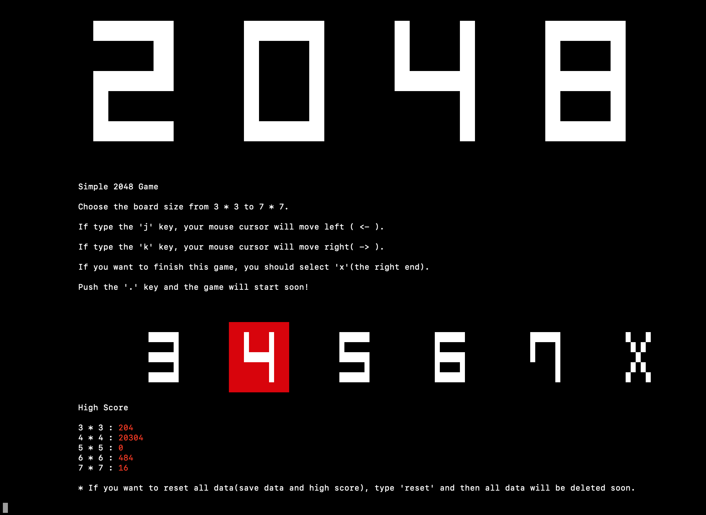
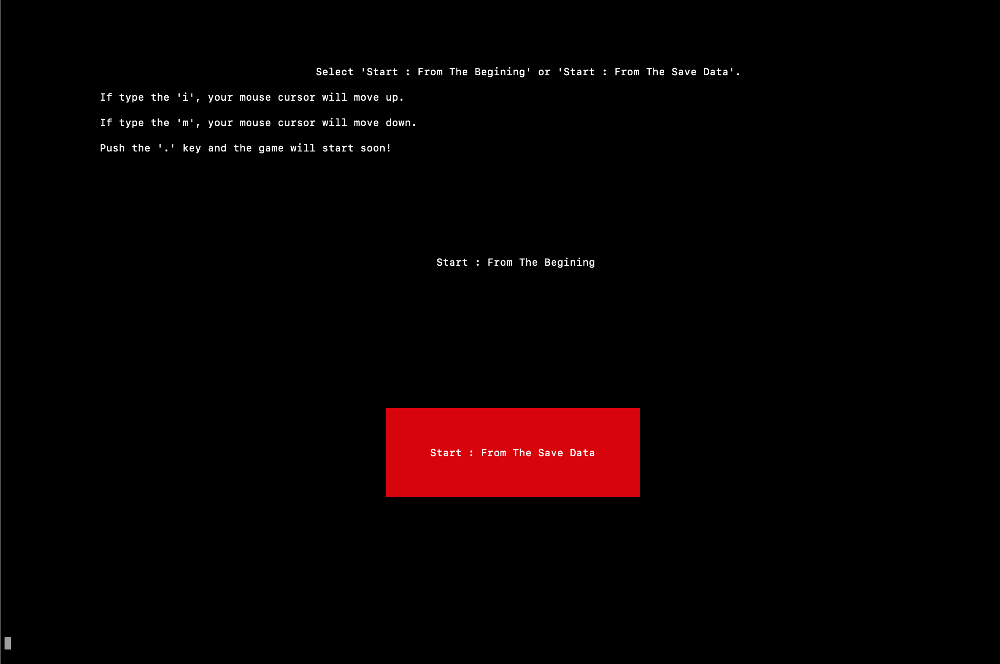
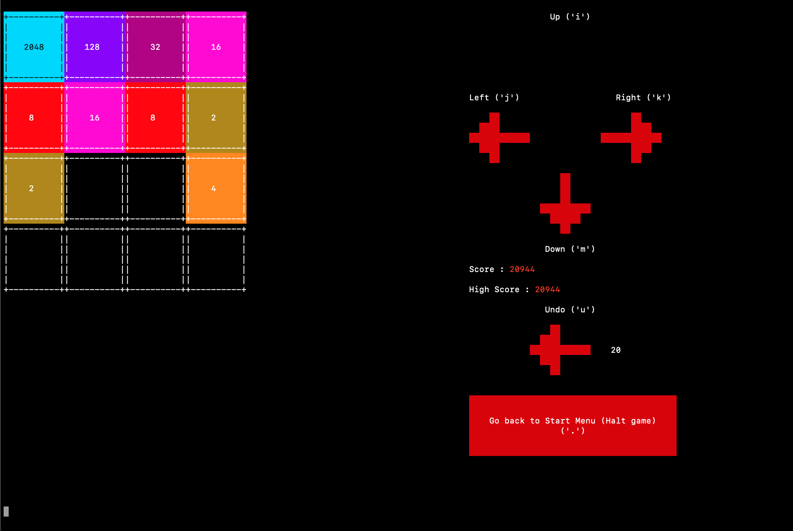
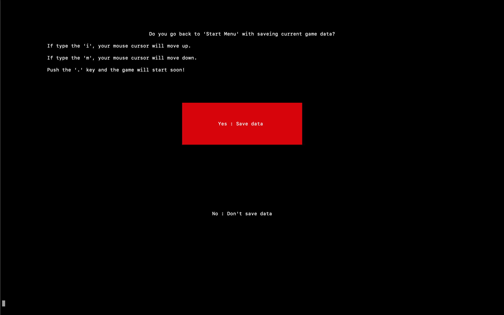
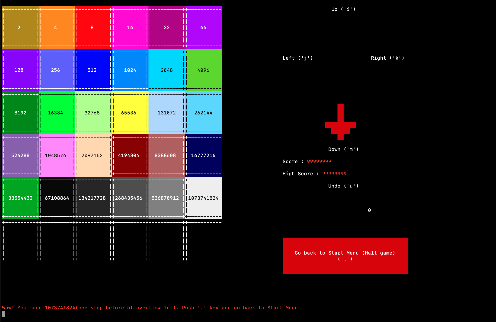

# 2048-CLI

## OverView

This is simple CLI 2048 Game. You can choose the size of board from 3 * 3 to 7 * 7, and undo up to 20 times ago. This game also have some functions : Saving data, recording high score, and resetting all data.

### The rule of 2048

I explain the rule of 2048 easily. If you want to understand the rule accurately or in detail, please search for other sources.

There is n * n grid and multiple of 2(including 0) is written in each cell. You can move one cell up, down, left, and right. If same number's cells collide, the numbers are added like 2+2=4, 4+4=8, 8+8=16, ... . After you move one cell, A cell which multiple of 2(not including 0) emerge randomly in n * n grid. Your purpose is making large number before you cannot move any cell because of full cells in grid.

## Installation

## Usage

### Keyboard control

* 'i' : Up

* 'm' : Down

* 'j' : Left

* 'k' : Right

* 'u' : Undo

* '.' : select button

### Start Menu

This is Start Menu. You can choose the size of board here. Please read the image below's description. You can also reset all data here. But, be careful, you cannot reposit deleted data.

### Play Screen

This is Play Screen. Cells will move soon after you type 'i', 'm', 'j', and 'k' without typing Enter key or '.' key.

## Limitation

* Terminal Size : Vertical - 52 lines or more, Horizon - 160 columns or more

* Terminal Background Color : Black(Dark color)

* Terminal Character Color : White

* 256 Color's Terminal Emulator(Using like `\033[48;5;120m`)

## Images

## License