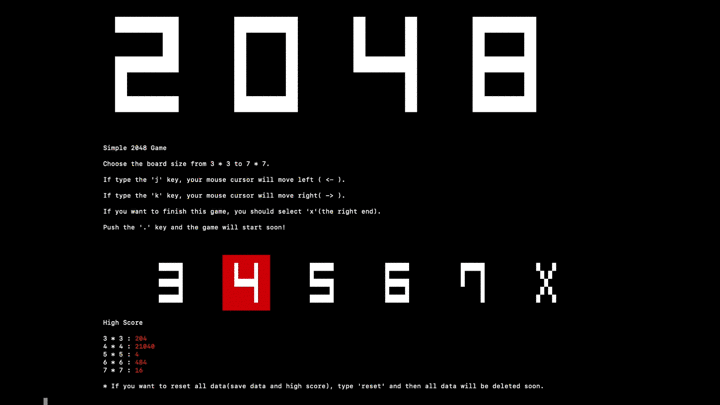

# 2048-CLI



## OverView

This is simple CLI 2048 Game. You can choose the size of board from 3 * 3 to 7 * 7, and undo up to 20 times ago. This game also have some functions : Saving data, recording high score, and resetting all data.

Original 2048 -> https://github.com/gabrielecirulli/2048

### The rule of 2048

I explain the rule of 2048 easily. If you want to understand the rule accurately or in detail, please search for other sources.

There is n * n grid and multiple of 2(including 0) is written in each cell. You can move one cell up, down, left, and right. If same number's cells collide, the numbers are added like 2+2=4, 4+4=8, 8+8=16, ... . After you move one cell, A cell which multiple of 2(not including 0) emerge randomly in n * n grid. Your purpose is making large number before you cannot move any cell because of full cells in grid.

## Installation

### Requirement

* gcc
* make


Execute next command on your terminal, or download Zip file and expand it.

```
$ git clone https://github.com/aiutarsi/2048-CLI.git
```

Change directories to the downloaded directory (this is the folder which you download from GitHub), and execute next command on your terminal.

```
$ make
$ ./2048
```

## Usage

### Start Game

Change directories to the the downloaded directory and execute below on terminal. (If you did `make` when you installed, you don't need `make` before `./2048`)

```
$ ./2048
```

### Keyboard control

* 'i' : Up
* 'm' : Down
* 'j' : Left
* 'k' : Right
* 'u' : Undo
* '.' : select button

### Start Menu

This is Start Menu. You can choose the size of board here. Please read the image below's description. You can also reset all data here. But, be careful, you cannot reposit deleted data.


### Play Screen

This is Play Screen. Cells will move soon after you type 'i', 'm', 'j', and 'k' without typing Enter key or '.' key.


### .sheets

.sheets contain files which written high score, and save data. I highly recommend not to edit these files because the probability that program throws errors is very high. If you edit them, typing `reset` at Start Menu is better way.

## Limitation

* **Terminal Size : Vertical - 52 lines or more, Horizon - 160 columns or more**

* Terminal Background Color : Black(Dark color)

* Terminal Character Color : White

* 256 Color's Terminal Emulator(Using like `\033[48;5;120m` in program)

## Images


## License

```
MIT License

Copyright (c) 2022 aiutarsi

Permission is hereby granted, free of charge, to any person obtaining a copy
of this software and associated documentation files (the "Software"), to deal
in the Software without restriction, including without limitation the rights
to use, copy, modify, merge, publish, distribute, sublicense, and/or sell
copies of the Software, and to permit persons to whom the Software is
furnished to do so, subject to the following conditions:

The above copyright notice and this permission notice shall be included in all
copies or substantial portions of the Software.

THE SOFTWARE IS PROVIDED "AS IS", WITHOUT WARRANTY OF ANY KIND, EXPRESS OR
IMPLIED, INCLUDING BUT NOT LIMITED TO THE WARRANTIES OF MERCHANTABILITY,
FITNESS FOR A PARTICULAR PURPOSE AND NONINFRINGEMENT. IN NO EVENT SHALL THE
AUTHORS OR COPYRIGHT HOLDERS BE LIABLE FOR ANY CLAIM, DAMAGES OR OTHER
LIABILITY, WHETHER IN AN ACTION OF CONTRACT, TORT OR OTHERWISE, ARISING FROM,
OUT OF OR IN CONNECTION WITH THE SOFTWARE OR THE USE OR OTHER DEALINGS IN THE
SOFTWARE.
```

## Bugs etc...

Please contact me through Issues or Pull requests. But I don't guarantee to see and reply it.
